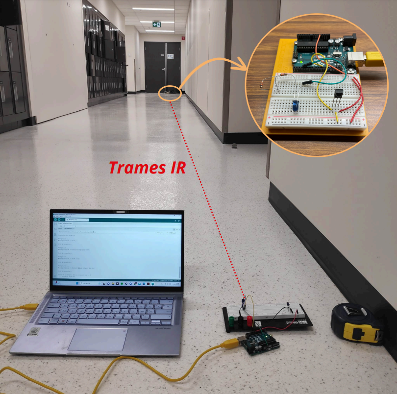
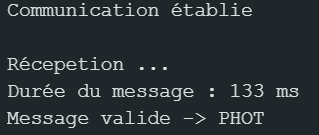

# Communication Bi-directionnelle par modulation laser

    
    
<strong>Communication bidirectionnelle à 20 m (940 nm)</strong>

# Objectif

L'objectif de ce projet est de permettre l'échange d'informations, telles que du texte, du son ou des images, en utilisant une diode laser infrarouge (IR). Grâce à deux modules Arduino équipés d'une diode et de récepteurs, il est possible de transmettre et de recevoir des données en encodant n'importe quelle information binaire. Le principe repose sur la modulation de l'intensité du laser, qui permet de représenter les données sous forme de trames ([Protocole NEC](https://techdocs.altium.com/display/FPGA/NEC+Infrared+Transmission+Protocol)). À la fin du projet, chaque utilisateur peut brancher son module Arduino à un PC et échanger du texte en temps réel sur une distance pouvant atteindre 25 mètres, en utilisant une console pour la communication série RS-232. Ce système offre un moyen innovant de communication optique, permettant la transmission efficace de données à distance avec un matériel simple et abordable.

# Réalisation

Pour gagner du temps et simplifier le développement, nous nous sommes appuyés sur une [bibliotèque](https://github.com/Arduino-IRremote/Arduino-IRremote) existante pour gérer la transmission des données. Cependant, une trame personnalisée, adaptée en fonction du type et de la quantité de données à envoyer, serait plus efficace et flexible dans un cadre plus étendu. Dans le cadre de cette étude, nous avons principalement travaillé sur l'envoi de texte. Toutefois, en augmentant la quantité de données binaires envoyées par trame, il est tout à fait possible de transmettre des fichiers plus volumineux, tels que des fichiers audio ou des images. Cela permettrait d'élargir considérablement les capacités du système.

Notre code permet d'envoyer des données encodées de deux façons distinctes. La première méthode utilise l'encodage UTF-8, qui offre un langage plus riche et permet de transmettre une plus grande variété de caractères. Cependant, cet encodage nécessite plus d'informations à envoyer, ce qui peut alourdir les trames. La seconde méthode repose sur l'encodage ASCII, qui est plus restreint en termes de caractères disponibles, mais offre l'avantage de réduire la taille des données à transmettre. En concaténant plusieurs lettres par trame, il est possible d'optimiser l'envoi pour des communications plus rapides et légères. On notera que le gain par caractère en encodage ASCII correspond à une vitesse d'envoi environ 3,3 fois plus rapide que pour l'encodage UTF-8.

    

        
        
<strong>Extrait du code pour l'encodage ASCII</strong>

    

    

        
        
<strong>Interface de réception pour l'encodage ASCII</strong>

    

